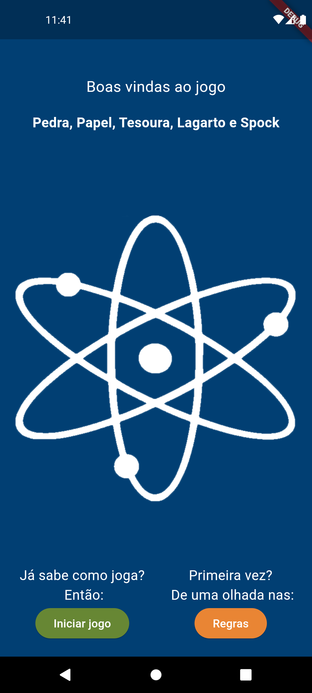
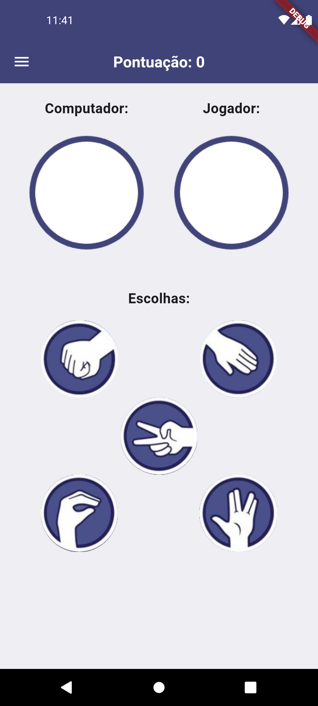
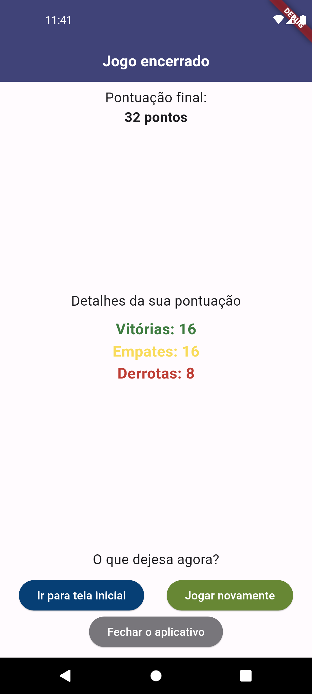
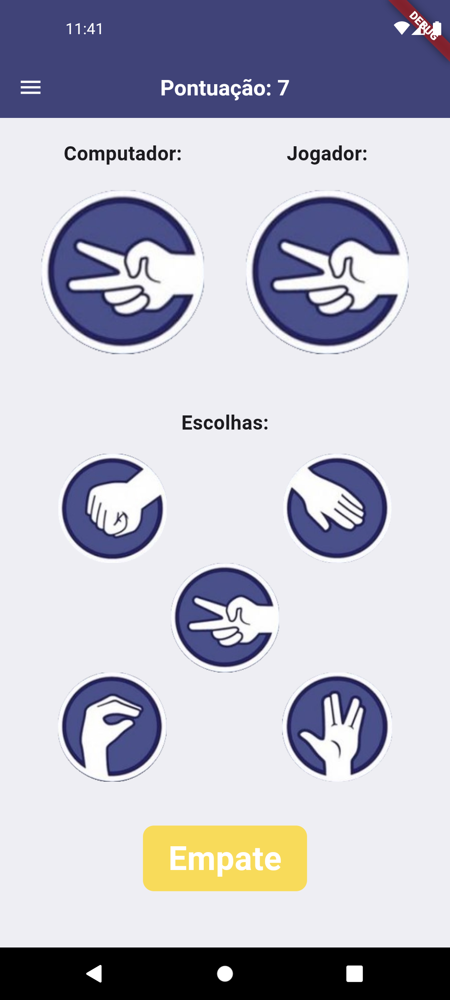

# Pedra - Papel - Tesoura - Lagarto - Spock

|  Tela Inicial  | Tela do Jogo | Tela de Regras | Tela Final | 
|:---:|:---:|:---:|:---:|
|  |  |  | |

#

|  Vitória  | Empate | Derrota | 
|:---:|:---:|:---:|
|  |  |  |

